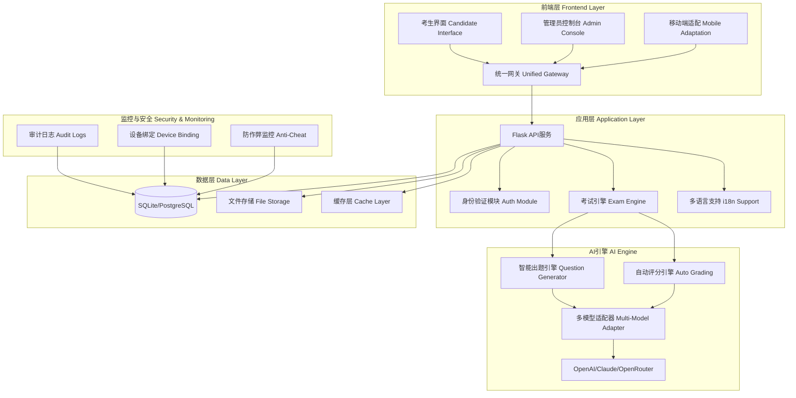
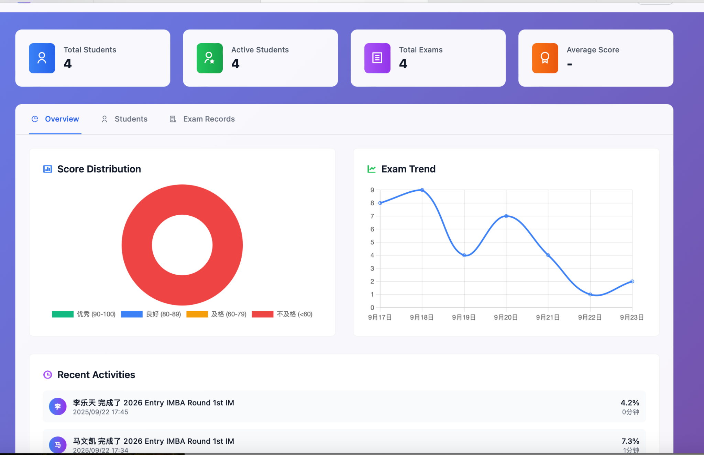
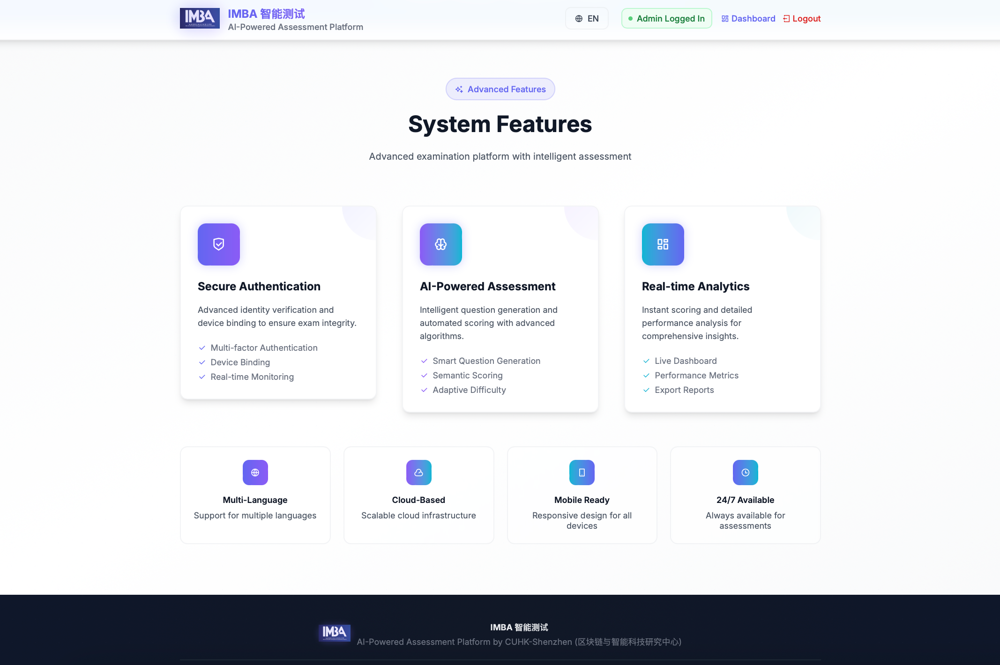
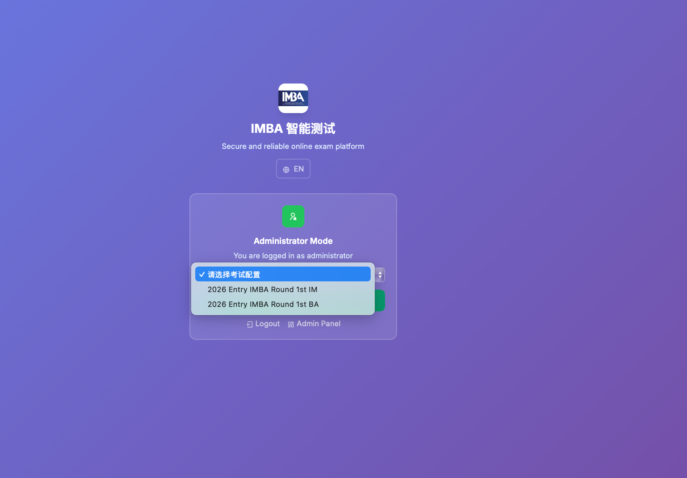
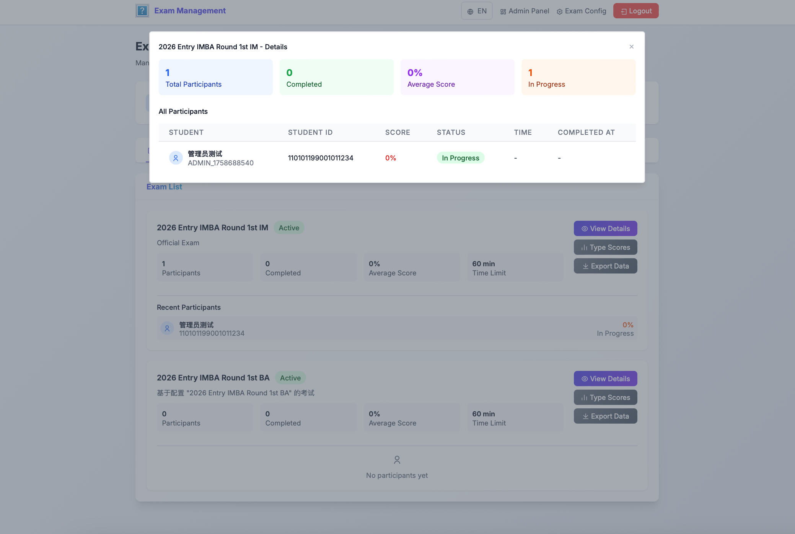
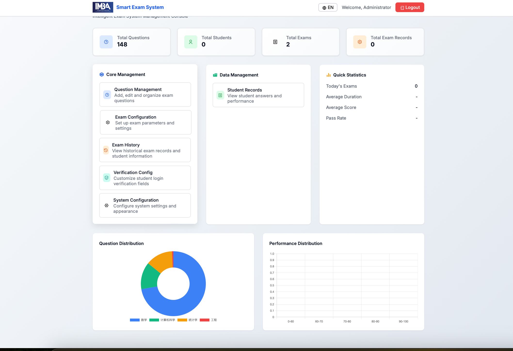
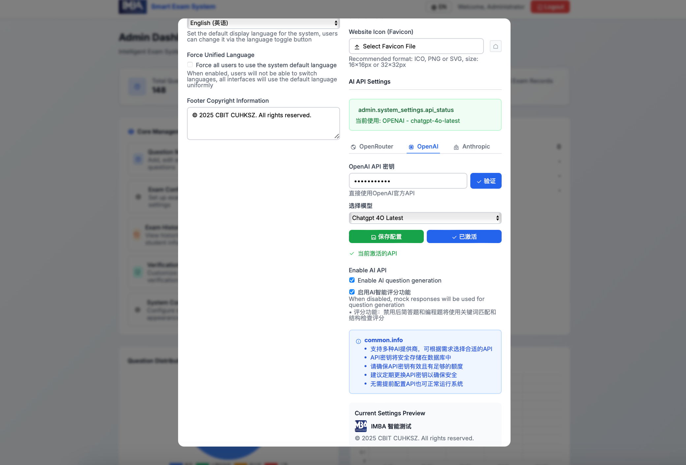
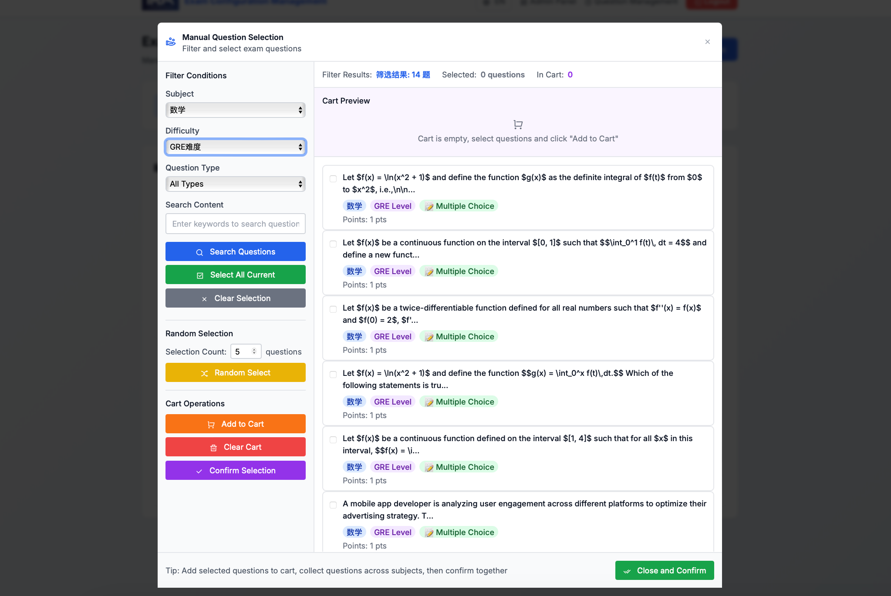
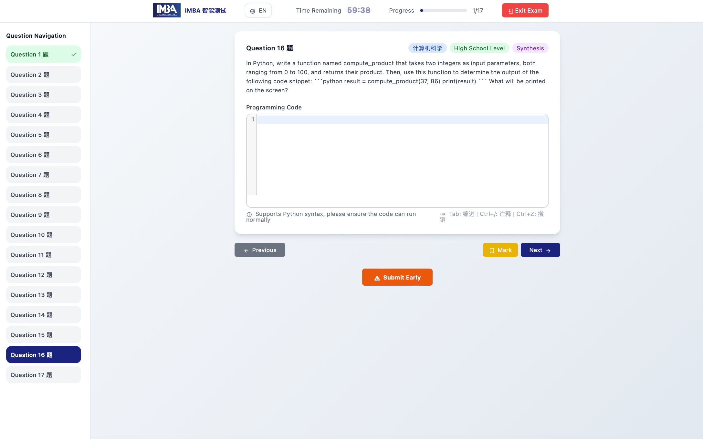

# CBIT AutoExam - 通用AI智能考试系统 / General AI-Powered Examination System

[](https://github.com/reneverland/CBIT-AiExam-plus)
[](https://github.com/reneverland/CBIT-AiExam-plus)
[](https://python.org)
[](LICENSE)

> **目标 Objective**：本系统为**通用版本**，适配多类考试与测评场景，而非仅用于硕士项目入学考试；支持院校、培训机构、企业认证、在线课程测评等。
> 
> **EN**: A general‑purpose AI‑powered examination platform for schools, training providers, enterprises, and online programs. Supports diverse assessment scenarios beyond just master's program admissions.

---

## 📚 目录 / Table of Contents

- [简介 / Introduction](#简介--introduction)
- [核心价值 / Key Value Propositions](#核心价值--key-value-propositions)
- [功能特性 / Features](#功能特性--features)
  - [🎯 智能出题 / AI Item Generation](#-智能出题--ai-item-generation)
  - [🔐 安全验证 / Identity & Integrity](#-安全验证--identity--integrity)
  - [⚡ 自动评分 / Auto‑Grading](#-自动评分--auto-grading)
  - [📊 数据分析 / Analytics](#-数据分析--analytics)
- [✨ 新功能亮点 / New Features](#-新功能亮点--new-features)
- [系统架构 / System Architecture](#系统架构--system-architecture)
- [技术栈 / Tech Stack](#技术栈--tech-stack)
- [快速开始 / Quick Start](#快速开始--quick-start)
  - [本地开发 / Local Development](#本地开发--local-development)
  - [Docker 部署 / Docker Deployment](#docker-部署--docker-deployment)
  - [生产环境（Nginx/SSL）/ Production](#生产环境nginxssl--production)
- [项目结构 / Project Structure](#项目结构--project-structure)
- [API 文档 / API Reference](#api-文档--api-reference)
- [配置说明 / Configuration](#配置说明--configuration)
- [开发指南 / Developer Guide](#开发指南--developer-guide)
- [贡献指南 / Contributing](#贡献指南--contributing)
- [许可证 / License](#许可证--license)
- [联系方式 / Contact](#联系方式--contact)
- [更新日志 / Changelog](#更新日志--changelog)

---

## 简介 / Introduction

**中文**：本系统是一个面向通用考试与测评场景的智能考试平台。依托大语言模型（LLM）与评测算法，支持多学科、多难度、语义判分、学情分析、反作弊、安全验证等。平台可按机构需求进行品牌化定制（Logo、主题、域名），并可 DIY 不同考试场景的题库与规则。

**EN**: A general‑purpose AI‑powered examination platform for schools, training providers, enterprises, and online programs. It delivers multi‑disciplinary item generation, adaptive difficulty, semantic scoring, in‑depth analytics, security and proctoring. The system is fully brandable and configurable for diverse assessment scenarios.

---

## 核心价值 / Key Value Propositions

**中文**：
- **规模化与个性化**：自动生成覆盖多学科与层级的个性化试卷
- **客观与主观兼容**：选择题、简答题、编程题均可自动或半自动评分
- **合规与安全**：身份校验、设备绑定、随机化与时限控制，降低舞弊风险
- **可运营性**：学情画像与看板，支持教学改进与管理决策

**EN**:
- **Scale & Personalization**: Auto-generate personalized exams across multiple disciplines and levels
- **Objective & Subjective Compatible**: MCQ, short-answer, and coding questions with automatic/semi-automatic scoring
- **Compliance & Security**: Identity verification, device binding, randomization, and time controls to reduce cheating risks
- **Operational**: Learning analytics and dashboards supporting instructional improvement and management decisions

---

## 功能特性 / Features

### 🎯 智能出题 / AI Item Generation

**中文**：
- **学科覆盖**：统计学、数学、计算机、物理、化学、历史等；支持子学科如微积分、线性代数、概率论、编程等；也可自定义学科
- **难度分级**：高中/GRE/研究生/博士生四级或自定义等级
- **认知层级**：理解 / 应用 / 综合（可映射 Bloom 等框架）
- **场景化题型**：情境题、案例题、数据题、代码题等
- **随机生成**：为每位考生生成差异化试卷；题目、选项、顺序随机化

**EN**:
- **Disciplines & Sub‑disciplines**: Statistics, Mathematics, CS, Physics, Chemistry, History… with sub‑tracks (Calculus, Linear Algebra, Probability, Programming). Custom disciplines supported
- **Difficulty Tiers**: High‑school / GRE / Master's / PhD (or custom scales)
- **Cognitive Levels**: Comprehension / Application / Synthesis (Bloom‑aligned)
- **Contextual Items**: Case‑based, data‑driven, coding, scenario questions
- **Randomization**: Unique exam per candidate; randomize items/options/order

### 🔐 安全验证 / Identity & Integrity

**中文**：
- **身份验证**：姓名、身份证号/申请号、学号等可选字段；支持 SSO
- **设备与网络**：IP/设备绑定、单会话控制、防重复考试
- **反作弊**：题库抽样、时间窗控制、切屏检测、行为日志、可接入人脸/摄像监考（选配）

**EN**:
- **Identity**: Name, national ID / application ID / student ID; SSO supported
- **Device & Network**: IP/device binding, single‑session, re‑entry control
- **Anti‑Cheat**: Randomized banks, time windows, tab‑switch detection, audit logs; optional webcam/face proctoring

### ⚡ 自动评分 / Auto‑Grading

**中文**：
- **多题型**：选择题、填空/简答、编程题
- **评分引擎**：规则判分 + AI 语义匹配 + 关键词/知识点校验；编程题支持样例用例与隐藏用例双层校验
- **即时反馈**：交卷即出分；可配置阅卷复核与仲裁流程
- **反馈维度**：学科、知识点、难度曲线、认知层级，附学习建议

**EN**:
- **Item Types**: MCQ, short‑answer, coding tasks
- **Scoring Engine**: Rules + AI semantic alignment + keyword/knowledge checks; code tasks validated by public & hidden test cases
- **Instant Results**: Immediate scoring; optional regrade and arbitration flows
- **Feedback**: Discipline/skill breakdown, difficulty curve, cognitive level tips

### 📊 数据分析 / Analytics

**中文**：
- **管理看板**：报名到完成漏斗、通过率、重考率、异常统计
- **教学洞察**：知识点对错率、题目区分度/难度、考生画像与群组对比
- **导出**：CSV/Excel/PDF；Webhook/REST 推送至第三方系统

**EN**: Admin dashboards (funnel, pass rate, anomalies), instructional insights (item difficulty/discrimination, skill mastery), exports & webhooks

---

## ✨ 新功能亮点 / New Features

### 🤖 多模型AI支持 / Multi-Model AI Support
**中文**：
- **统一API接口**：兼容OpenAI、Claude、OpenRouter等主流LLM API
- **智能降级**：未配置API时自动切换手动模式
- **动态切换**：支持运行时切换不同AI模型
- **成本优化**：根据题目难度选择合适的模型

**EN**:
- **Unified API Interface**: Compatible with OpenAI, Claude, OpenRouter and other mainstream LLM APIs
- **Smart Degradation**: Automatically switch to manual mode when API is not configured
- **Dynamic Switching**: Support runtime switching between different AI models
- **Cost Optimization**: Select appropriate models based on question difficulty

### 📊 统计下载功能 / Statistical Download Features
**中文**：
- **一键导出**：Excel/CSV格式成绩报告
- **多维度统计**：按学科、难度、时间等维度分析
- **可视化图表**：内置图表展示，支持打印
- **批量操作**：支持批量导出多场考试数据

**EN**:
- **One-click Export**: Excel/CSV format grade reports
- **Multi-dimensional Statistics**: Analysis by subject, difficulty, time and other dimensions
- **Visualized Charts**: Built-in chart display with print support
- **Batch Operations**: Support batch export of multiple exam data

### 🌍 完整国际化 / Complete Internationalization
**中文**：
- **实时语言切换**：中英文界面无缝切换
- **手动选择窗口**：题目筛选界面完整多语言支持
- **管理后台**：全部管理功能多语言适配
- **考试界面**：考生端完整国际化体验

**EN**:
- **Real-time Language Switching**: Seamless Chinese-English interface switching
- **Manual Selection Window**: Complete multilingual support for question filtering interface
- **Admin Backend**: Full multilingual adaptation for all management functions
- **Exam Interface**: Complete internationalization experience for candidates

### ⚙️ 零配置部署 / Zero-Configuration Deployment
**中文**：
- **可视化配置**：Web界面配置所有参数
- **品牌定制**：自定义Logo、系统名称、主题
- **考试规则**：灵活的题目选择和评分策略
- **安全设置**：防作弊参数精细化控制

**EN**:
- **Visual Configuration**: Configure all parameters through web interface
- **Brand Customization**: Custom Logo, system name, themes
- **Exam Rules**: Flexible question selection and scoring strategies
- **Security Settings**: Fine-grained control of anti-cheating parameters

---

## 系统架构 / System Architecture



**中文架构说明**：
- **Backend**: Flask + SQLAlchemy；RESTful API；可扩展任务队列（RQ/Celery）
- **AI Engine**: 统一模型接口；适配 OpenAI、OpenRouter 与自训练模型
- **Storage**: 关系型数据库（默认 SQLite，可切换到 Postgres/MySQL）
- **Frontend**: 轻量前端（可选 React/Vue）；品牌与主题可配置
- **Ops**: Docker 化部署，Nginx 反向代理，CI/CD（GitHub Actions）

**EN Architecture**: Flask API, SQLAlchemy ORM, unified LLM adapter (OpenAI/OpenRouter/custom), RDBMS (SQLite→Postgres/MySQL), optional queues, containerized with Nginx & CI/CD.

---

## 技术栈 / Tech Stack

| 层级 Layer | 中文 Chinese | English |
|------------|--------------|---------|
| **后端 Backend** | Python 3.11+, Flask, SQLAlchemy | Python 3.11+, Flask, SQLAlchemy |
| **AI引擎 AI Engine** | OpenAI / OpenRouter API (可插拔适配器) | OpenAI / OpenRouter API (pluggable adapter) |
| **前端 Frontend** | HTML/JS (可选 React/Vue) | HTML/JS (optionally React/Vue) |
| **运维 DevOps** | Docker, docker‑compose, GitHub Actions, Nginx | Docker, docker‑compose, GitHub Actions, Nginx |
| **数据库 Database** | SQLite (开发) / PostgreSQL (生产) | SQLite (dev) / PostgreSQL (prod) |
| **监控 Monitoring** | 内置审计日志和性能监控 | Built-in audit logs and performance monitoring |

---

## 快速开始 / Quick Start

### Docker 一键部署 / Docker One-Click Deployment

```bash
# 克隆项目 / Clone repository
git clone https://github.com/reneverland/CBIT-AiExam-plus.git
cd CBIT-AiExam-plus

# 一键启动 / One-click start
docker-compose up -d

# 访问系统 / Access system
# 🌐 主页 Homepage: http://localhost:8080
# 📋 管理后台 Admin: http://localhost:8080/admin/dashboard
# 👤 管理员账号 Admin: admin / imbagogo
```

### 本地开发 / Local Development

```bash
# 安装依赖 / Install dependencies
pip install -r requirements.txt

# 初始化数据库 / Initialize database
python database/init_db.py

# 启动应用 / Start application
python run.py

# 访问系统 / Access system
# 🌐 主页 Homepage: http://localhost:8080
# 📋 管理后台 Admin: http://localhost:8080/admin/dashboard
# 👤 管理员账号 Admin: admin / imbagogo
```

### 部署检查 / Deployment Check

```bash
# 检查容器状态 / Check container status
docker-compose ps

# 查看日志 / View logs
docker-compose logs -f

# 健康检查 / Health check
curl http://localhost:8080/health
```


---

## 项目结构 / Project Structure

```
cbit-lite-trainer/
├── 🎯 ai_engine/              # AI智能引擎 / AI Engine
│   ├── api_manager.py          # 多模型API管理器 / Multi-Model API Manager
│   ├── advanced_generator.py   # 高级题目生成器 / Advanced Question Generator
│   ├── smart_generator.py      # 智能生成算法 / Smart Generation Algorithm
│   └── validator.py           # 题目质量验证 / Question Quality Validator
├── ⚡ backend/                # 后端核心 / Backend Core
│   ├── app.py                 # Flask应用主体 / Flask Application Main
│   ├── models.py              # 数据模型定义 / Data Model Definition
│   └── scoring.py             # 评分算法引擎 / Scoring Algorithm Engine
├── 🌐 frontend/               # 前端界面 / Frontend Interface
│   ├── index.html             # 系统首页 / System Homepage
│   ├── exam.html              # 考试答题界面 / Exam Interface
│   ├── admin_dashboard.html   # 管理员控制台 / Admin Console
│   ├── exam_config_management.html  # 考试配置管理 / Exam Config Management
│   ├── question_management.html     # 题库管理 / Question Bank Management
│   └── static/js/
│       ├── i18n.js            # 多语言支持 / Internationalization Support
│       └── api-helper.js      # API调用助手 / API Call Helper
├── 🗄️ database/              # 数据库 / Database
│   └── init_db.py            # 初始化脚本 / Initialization Script
├── 🐳 docker/                # 容器化部署 / Containerized Deployment
│   └── Dockerfile
├── ⚙️ 配置文件 / Configuration Files
│   ├── requirements.txt       # Python依赖 / Python Dependencies
│   ├── env.example           # 环境变量模板 / Environment Variable Template
│   └── run.py               # 启动入口 / Startup Entry
└── 📋 README.md             # 项目说明 / Project Documentation
```

---

## API 文档 / API Reference

> **Base URL**: `/api`

### 身份 / Identity
**中文**：
- `POST /api/verify-student`：验证姓名、证件号、申请号等，可接 SSO
  
**EN**: Verify candidate identity; supports SSO

### 出题 / Generation
**中文**：
- `POST /api/generate-exam`：按学科/子学科、难度、认知层级生成试卷；支持随机化与限制规则
  
**EN**: Generate exam by discipline, difficulty, cognition; randomized

### 作答与提交 / Answering
**中文**：
- `GET /api/exam-questions/<exam_id>`：获取题目与作答参数
- `POST /api/submit-answer`：提交单题答案（支持编程题代码与附件）
- `POST /api/submit-exam`：交卷；触发评分与报告生成
  
**EN**: 
- Fetch items for an exam
- Submit single‑item answer
- Submit exam; trigger grading & reports

### 成绩与报告 / Results
**中文**：
- `GET /api/exam-results/<exam_id>`：获取成绩与反馈；可导出
  
**EN**: Retrieve scores & feedback; exportable

### 核心接口表 / Core API Endpoints
| 端点 Endpoint | 方法 Method | 描述 Description |
|---------------|-------------|------------------|
| `/api/verify-student` | POST | 考生身份验证 / Candidate identity verification |
| `/api/exam-configs` | GET/POST | 考试配置管理 / Exam configuration management |
| `/api/questions` | GET/POST | 题库管理 / Question bank management |
| `/api/generate-questions` | POST | AI智能出题 / AI question generation |
| `/api/submit-exam` | POST | 提交考试答案 / Submit exam answers |
| `/api/exam-results/<id>/export` | GET | 导出成绩报告 / Export grade reports |
| `/api/translations` | GET | 多语言翻译数据 / Multilingual translation data |
| `/api/system-config` | GET/PUT | 系统配置管理 / System configuration management |

> **注意 Note**: 所有写操作要求鉴权（JWT/Session/SSO），并记录审计日志。  
> **EN**: All write ops require auth and audit logging.

---

## 配置说明 / Configuration

**零配置部署 / Zero-Configuration Deployment**：
- ✅ 无需预配置环境变量 / No need to pre-configure environment variables
- ✅ 启动后通过Web界面配置API密钥 / Configure API keys through web interface after startup
- ✅ 未配置AI时自动降级为手动出题模式 / Automatically downgrade to manual question mode when AI is not configured
- ✅ 配置完成后自动启用AI功能 / Automatically enable AI functionality after configuration

**可选环境变量 / Optional Environment Variables**：
```ini
# 应用配置 / App Configuration
DATABASE_URL=sqlite:///instance/exam.db
FLASK_ENV=development
FLASK_DEBUG=True

# AI模型（在管理面板中配置更方便）/ AI Models (easier to configure in admin panel)
# OPENROUTER_API_KEY=your-openrouter-api-key
# OPENAI_API_KEY=your-openai-api-key
# AI_MODEL=openai/gpt-4-turbo-preview

# 安全设置（可选）/ Security Settings (optional)
ALLOWLIST_IPS=
ENFORCE_SINGLE_SESSION=true
TAB_SWITCH_THRESHOLD=5
```

---

## 开发指南 / Developer Guide

### 添加新题型 / Add a New Item Type
**中文**：
1. 在 `ai_engine/generator.py` 定义题型模板与元数据
2. 在 `backend/scoring.py` 增加评分逻辑（规则/语义/编程用例）
3. 在前端增加对应输入组件与校验

**EN**:
1. Define item type templates and metadata in `ai_engine/generator.py`
2. Add scoring logic in `backend/scoring.py` (rules/semantic/coding cases)
3. Add corresponding input components and validation in frontend

### 自定义模型 / Custom LLMs
**中文**：
- 通过 `AI_MODEL` 与 API Key 切换不同提供方；实现同一接口的适配器（Adapter）
- 支持温度/惩罚系数/最大 Token 等推理参数

**EN**:
- Switch between different providers via `AI_MODEL` and API Key; implement adapters with the same interface
- Support inference parameters like temperature/penalty/max tokens

### 集成 / Integrations
**中文**：
- **Webhook**：成绩与学情回传第三方
- **SSO**：对接校园/企业身份系统（OAuth2/SAML）

**EN**:
- **Webhook**: Pass back grades and learning analytics to third parties
- **SSO**: Connect to campus/enterprise identity systems (OAuth2/SAML)

---

## 贡献指南 / Contributing

**中文**：
1. Fork 仓库
2. 新建分支 `git checkout -b feature/AmazingFeature`
3. 提交修改 `git commit -m "Add some AmazingFeature"`
4. 推送分支 `git push origin feature/AmazingFeature`
5. 提交 Pull Request

**开发规范**：
- 遵循PEP 8代码规范
- 编写单元测试
- 更新相关文档
- 确保CI/CD流程通过

**EN**:
1. Fork the repository
2. Create feature branch `git checkout -b feature/AmazingFeature`
3. Commit changes `git commit -m "Add some AmazingFeature"`
4. Push branch `git push origin feature/AmazingFeature`
5. Create Pull Request

**Development Standards**:
- Follow PEP 8 code standards
- Write unit tests
- Update relevant documentation
- Ensure CI/CD pipeline passes

---

## 📊 使用统计 / Usage Statistics

| 指标 Metrics | 中文 Chinese | English |
|--------------|--------------|---------|

| 📝 考试场次 | **100+** 考试场次 | **100+** exam sessions |
| 🎓 服务考生 | **1K+** 考生服务 | **1K+** candidates served |

---

## 许可证 / License

本项目采用 [MIT License](LICENSE) 开源协议。  
This project is licensed under the [MIT License](LICENSE).

---

## 联系方式 / Contact

- **维护者 Maintainer**: Reneverland
- **邮箱 Email**: renshi@cuhk.edu.cn
- **项目主页 Repository**: https://github.com/reneverland/CBIT-AiExam-plus
- **问题反馈 Issues**: [GitHub Issues](https://github.com/reneverland/CBIT-AiExam-plus/issues)
- **功能建议 Discussions**: [GitHub Discussions](https://github.com/reneverland/CBIT-AiExam-plus/discussions)

---

## 更新日志 / Changelog

### v1.11.0 (2025-09-24) - 最新版本 / Latest Version
**中文**：
- 🌍 **完整国际化**：手动筛选窗口多语言支持
- 🤖 **多模型支持**：统一适配OpenAI/Claude/OpenRouter
- 📊 **增强统计**：新增导出功能和可视化图表
- ⚙️ **灵活配置**：考试配置管理界面优化
- 🔧 **零配置部署**：支持启动后Web配置API密钥

**EN**:
- 🌍 **Complete Internationalization**: Manual selection window multilingual support
- 🤖 **Multi-Model Support**: Unified adaptation for OpenAI/Claude/OpenRouter
- 📊 **Enhanced Statistics**: New export features and visualization charts
- ⚙️ **Flexible Configuration**: Optimized exam configuration management interface
- 🔧 **Zero-Configuration Deployment**: Support web configuration of API keys after startup

### v1.10.0 (2025-09-23)
**中文**：
- 🎯 **智能出题**：AI题目生成引擎优化
- 🔐 **安全增强**：设备绑定和防作弊监控
- 📱 **移动适配**：响应式设计优化
- 🚀 **性能提升**：数据库查询和API响应优化

**EN**:
- 🎯 **Intelligent Question Generation**: AI question generation engine optimization
- 🔐 **Security Enhancement**: Device binding and anti-cheating monitoring
- 📱 **Mobile Adaptation**: Responsive design optimization
- 🚀 **Performance Improvement**: Database query and API response optimization

### v1.1.3 (2025‑09‑23)
**中文**：
- 🔧 优化API密钥配置：支持系统设置中配置，无需环境变量强制要求
- 🎯 智能功能降级：未配置API密钥时自动禁用AI功能，手动功能始终可用
- 🚀 零配置部署：Docker容器可直接启动，用户友好的配置向导
- 📋 用户体验优化：清晰的错误提示和配置引导
- 🔄 动态功能切换：配置API密钥后自动启用AI功能，无需重启

**EN**:
- 🔧 Optimized API key configuration: Support configuration in system settings, no mandatory environment variables required
- 🎯 Smart feature degradation: Automatically disable AI features when API keys are not configured, manual features always available
- 🚀 Zero-configuration deployment: Docker containers can start directly, user-friendly configuration wizard
- 📋 User experience optimization: Clear error messages and configuration guidance
- 🔄 Dynamic feature switching: Automatically enable AI features after configuring API keys, no restart required

---

## 🖼️ 界面预览 / UI Screenshots

> 以下为当前系统的真实界面截图 / The following are real screenshots of the current system

### 📊 管理控制台 / Admin Dashboard
**中文**: 管理员总览面板，展示考试统计、系统状态和快速操作入口  
**EN**: Administrator overview panel showing exam statistics, system status and quick operation entries



### 🏠 系统主页 / System Homepage
**中文**: 用户友好的系统首页，提供清晰的功能导航和访问入口  
**EN**: User-friendly system homepage providing clear functional navigation and access points



### 🚪 考试入口 / Exam Entry
**中文**: 考试验证和准入界面，确保考生身份和考试环境安全  
**EN**: Exam verification and entry interface ensuring candidate identity and secure exam environment



### ⚙️ 考试配置 / Exam Configuration
**中文**: 灵活的考试配置界面，支持题目筛选、难度设置和时间控制  
**EN**: Flexible exam configuration interface supporting question filtering, difficulty settings and time controls


### 🎯 考试管理 / Exam Management  
**中文**: 考试实例管理界面，支持批量操作和状态监控  
**EN**: Exam instance management interface with batch operations and status monitoring



### 📊 数据看板 / Analytics Dashboard
**中文**: 详细的数据分析看板，展示考试统计和学情分析  
**EN**: Detailed analytics dashboard showing exam statistics and learning insights



### 🤖 AI模型配置 / AI Model Configuration
**中文**: 多模型AI配置界面，支持OpenAI、Claude等主流LLM  
**EN**: Multi-model AI configuration interface supporting OpenAI, Claude and other mainstream LLMs



### 📝 手动题目筛选 / Manual Question Selection
**中文**: 智能的手动题目筛选界面，支持多维度筛选和预览  
**EN**: Smart manual question selection interface with multi-dimensional filtering and preview



### 💻 考试答题界面 / Exam Interface
**中文**: 支持代码题的考试界面，提供语法高亮和实时保存功能  
**EN**: Exam interface supporting coding questions with syntax highlighting and real-time saving



---

<div align="center">

**🎓 让AI为教育赋能，让考试更智能！ / Empower Education with AI, Make Exams Smarter!**

[🚀 立即部署 Deploy Now](https://github.com/reneverland/CBIT-AiExam-plus) •

</div>